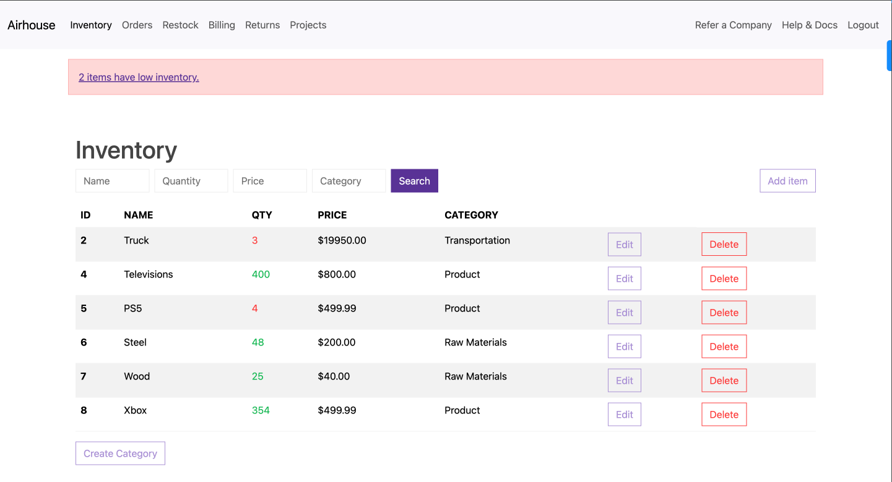
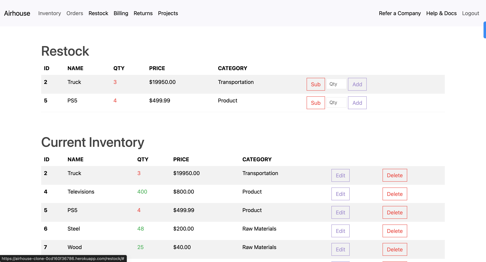

# [Airhouse Clone](https://airhouse-clone-0cd160f36786.herokuapp.com/)
Built with **Django framework**, **AWS RDS Postgres** database, **Bootstrap**, and a sprinkle of **JavaScript**. Deployed on **Heroku**. 

## Inventory
Create categories and manipulate your company inventory. Low inventory alerts to assist in supply management. 

## Orders
Submit new orders and update status of existing orders. Filter orders on desired attribute. 

## Restock
Manipulate inventory quantity. Low inventory items appear with highest priority. 

### Future Improvements
- [ ] Orders placed directly affect inventory quantities
- [ ] Build out Billing, Returns, Projects

      